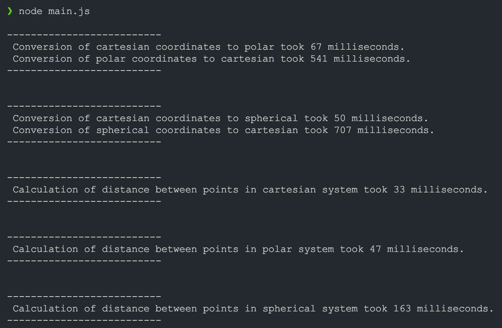
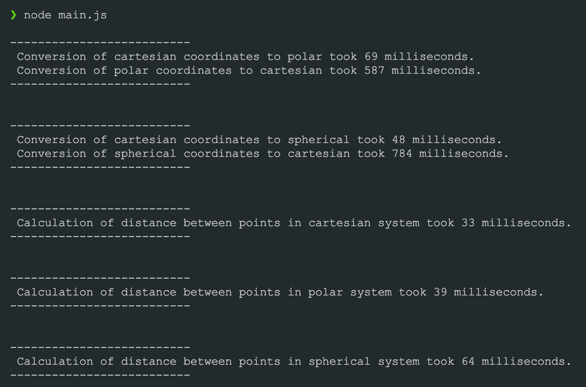

# Practice #1

## Result of running each function 1000000 times

- 
- 
- 

## Conclusion

1. Cartesian coordinate system is the fastest one thanks to the simpliest calculations as with converting it to another coordinate system and with calculating distances between points in the coordinate system.
2. The speed of conversion from polar coordinates to cartesian is faster than the speed of conversion from spherical to cartesian. However, it is interesting to note that the conversion from cartesian coordinates to polar is slower than the conversion from cartesian to spherical.
3. Here is a list (from fastest to slowest) of coordinate systems that showcases the speed of calculation of the distance between points in different coordinate systems relative to each other:
   1. Cartesian
   2. Polar
   3. Spherical
