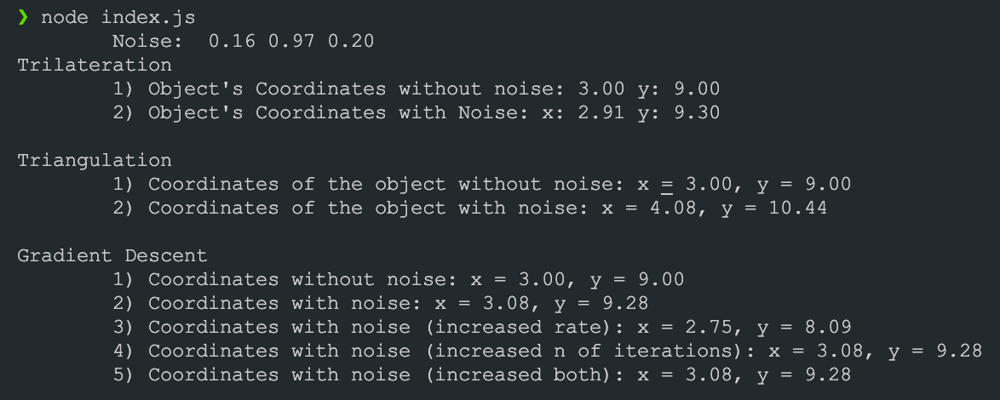
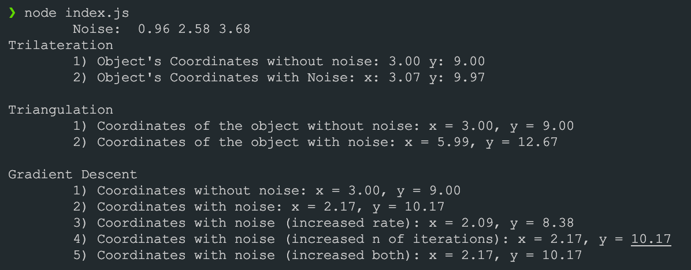
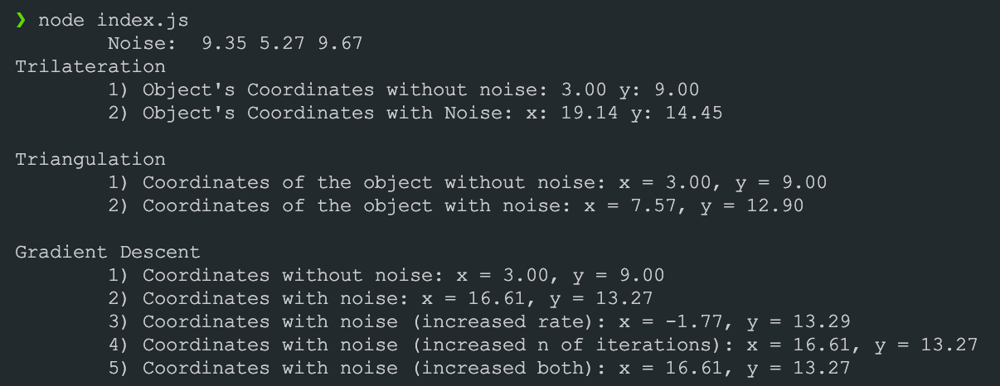
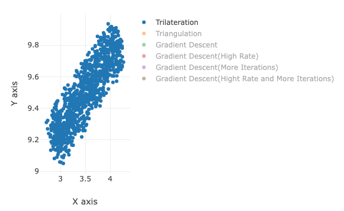
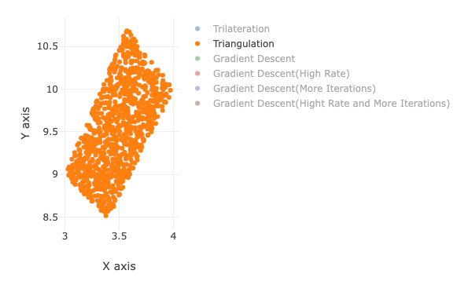
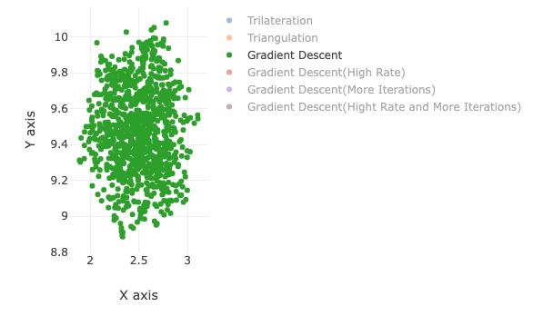
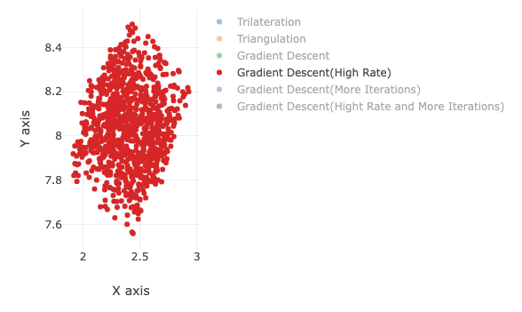
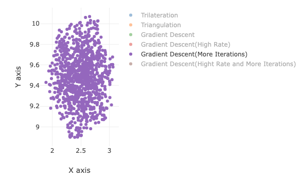
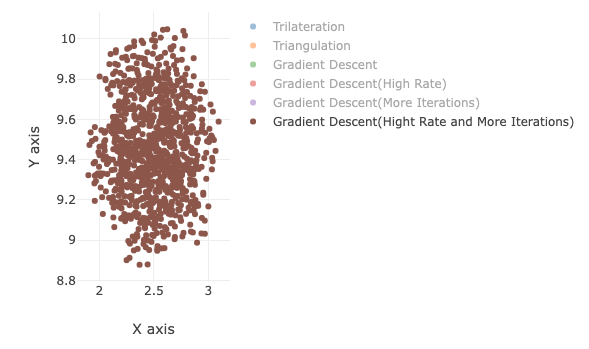

# Practice #3

## Result of running the program

1. 0 < noise < 1
   
1. 0 < noise < 5
   
1. 0 < noise < 10
   

## Graph distribution of points

1. Trilateration
   

2. Triangulation
   

3. Gradient descent
   

4. Gradient descent with high rate
   

5. Gradient descent with more iterations
   

6. Gradient descent with Both high rate and more iterations
   

## Conclusion

Prerequisites: object coordinates = (3, 9)
Here is a list of accurace of the methods (most accurate at the top):

- Gradient Descent (high rate and more iterations) - most accurate results, but more performance needed.
- Gradient Descent (base) - gets very close values to the original coordinates.
- Gradient Descent (more iterations) - one of the best methods, thus number of iterations make the difference.
- Triangulation - usually has around 7 point near the original coordinates.
- Trilateration - usually has around 3 point near the original coordinates.
- Gradient Descent (high rate) - the worst method of all 6. Tends to point (0, 0).
