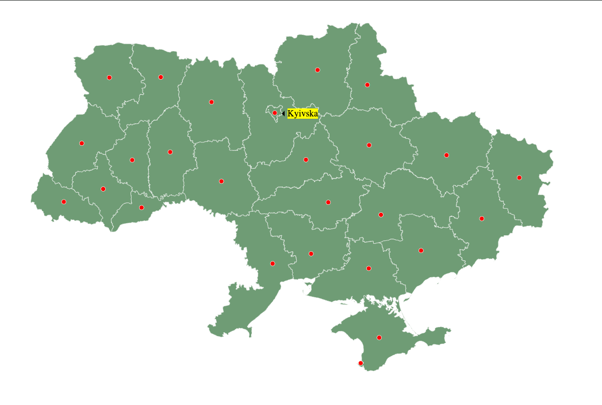

# Practice #4

To view the result of the program, open the index.html file in the borser

## Result of running the program

## Conclusion

The overall outline of the map of Ukraine is accurate, but, obviously, may have some flaws. Some of the markes of regional centers are far from accurate, some are more accurate, but these flaws were allowed to match the dedline.
The UX/UI of the map is average, but it certainly does the task it was meant to do.
The biggest challange was to show and hide the tooltip that correspons to the its point.
